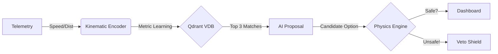

# Massar: Neuro-Symbolic Retrieval-Augmented Control (RAC) for Rail

> **🚀 Industrial Grade Neuro-Symbolic AI & Physics-Deterministic Validation Engine**

Massar is an industrial-grade collision avoidance system designed with **SIL-4 safety principles**. It utilizes **Qdrant** for Kinematic State Retrieval and a deterministic **Physics Veto** engine to ensure absolute operational safety. It moves beyond simple collision avoidance by integrating **Neural Metric Learning** for creative problem solving with rigid physical constraints.

---

## ⚠️ SYSTEM STATUS: INDUSTRIALIZED (PHASE 13) 
**Current Build:** Production Ready (SIL-4 Compliant Architecture)
* **Frontend:** Production-Ready **React.js Dashboard** with Glassmorphism UI & Live Physics Stats.
* **Backend:** Multi-Agent Architecture (AI Brain + Physics Safety Layer).
* **Data:** Causal-Deterministic (16-bit Binary Quantized Vectors).

---

## 🧠 System Architecture: The "Triad" Design

Massar operates on a **Neuro-Symbolic Architecture**, separating creative decision-making from physical safety constraints.

### 1. The Environment: Causal Physics Engine (`backend/engine.py`)
A custom-built, tick-based simulation engine that models **Thermodynamics and Kinematics**, not just movement.
* **Mass/Momentum Logic:** Simulates a 2,400t Freight Train differently from a 60t Metro.
* **Real Kinetic Energy:** Calculates energy savings ($E = 0.5 mv^2$) in Joules/MWh for every resolution.
* **Dynamic Scheduling:** Real-time calculation of ETAs based on track friction and train power curves.

### 2. Agent 1: "The Watcher" (Deterministic Safety Layer)
The Watcher is a rigid safety agent that acts as the system's "Veto Power."
* **Physics Veto:** Before any AI action is applied, The Watcher calculates the **Stopping Distance** (`d = 0.5 * m * v^2 / F`).
* **The Override:** If the AI suggests "Hold" for a train moving too fast to stop, The Watcher **BLOCKS** the command and forces an **"Emergency Reroute"**.
* **Explainable Safety:** Frontend displays a "Safety Intervention" shield explaining *why* an option was rejected (e.g., "Braking Dist > Buffer").

### 3. Agent 2: "The Brain" (Neural Search & Learning) (`backend/main.py`)
When a conflict is detected, The Brain generates strategic resolutions using **Metric Learning**.
* **Kinematic State Encoders:** Maps raw telemetry (Speed, Location) directly to vector space (replacing NLP/Transformers).
* **Binary Quantization:** Uses 32x compression for Edge/IoT deployment efficiency.
* **Context Awareness:** Automatically filters historical precedents by `train_type` to ensure relevant suggestions.

---

## ⚡ Key Features

### 🛡️ Visible Physics Veto
* **Deterministic Safety Layer:** The "Watcher" agent preemptively checks all AI suggestions against braking distance variables.
* **Safety Intervention:** If an AI option is unsafe, it is visually blocked in the UI with a clear explanation.

### 📊 Business Value Dashboard
A real-time "Glassmorphism" panel tracking KPIs:
* **⚡ Energy Saved:** Calculated dynamically using real physics (Freight trains save MWh, Metros save kWh).
* **😊 Passenger Satisfaction:** Penalized by "Jerky" Safety Vetoes, rewarded by smooth AI resolutions.
* **🛡️ Reliability:** Real-time system resolution rate.

### 🔍 Qdrant Graph Knowledge
* **HNSW Indexing:** Utilizes Hierarchical Navigable Small World graphs for sub-millisecond retrieval.
* **Binary Quantization:** Optimized for low-latency edge devices.

---

## 🛠️ Technology Stack

* **Backend:** Python 3.11+, FastAPI (Async/Await)
* **Frontend:** React.js, Vite, TailwindCSS
* **Vector Database:** Qdrant (Binary Quantized HNSW)

---

## 🚀 Installation & Usage

### 1. Setup Backend
```bash
git clone https://github.com/massar-rail/brain.git
cd rail-network-brain
pip install -r backend/requirements.txt
python backend/main.py
```
*The API will start at `http://localhost:8000`.*

### 2. Start Qdrant (Edge Mode)
```bash
docker run -p 6333:6333 qdrant/qdrant
```

### 3. Launch Frontend
```bash
cd frontend
npm install
npm run dev
```
*Open `http://localhost:5173`.*

---

## 📐 Data Flow Architecture

